# DormDash

DormDash is a campus-only delivery app that helps students order from on-campus vendors and services in minutes.

**Where You Can Use It**
- Android phones and tablets
- Windows desktop app
- Web browser

**What You Can Do**
- Discover campus vendors like canteens, laundry, and stores
- Add items to a cart and place orders quickly
- Pay with UPI, cash on delivery, or a demo net-banking flow
- Track orders and review past purchases
- Manage your profile and payment preferences

**How It Works**
1. Sign in with email or phone
2. Browse vendors and add items to your cart
3. Choose a payment method and place your order
4. Track your order status in the app

**Good For**
- Quick meals between classes
- Laundry pickup and delivery
- Small daily essentials without leaving campus

**Notes**
- Payments are shown as demo flows for testing.
- Features may vary by campus and vendor availability.

**Screenshots**
1. Splash Screen: App launch branding and loading state.
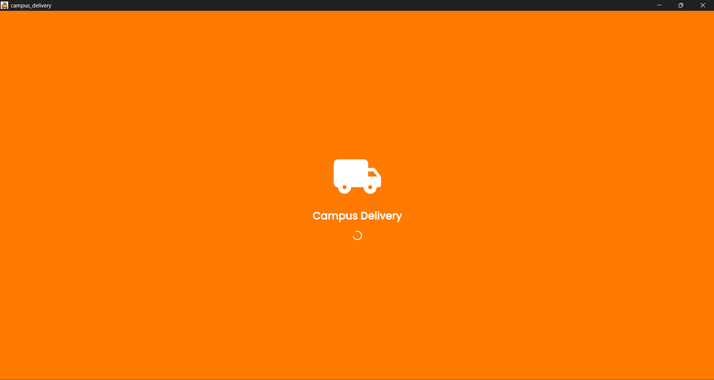

2. Sign In: Email/password login with quick links to sign up or phone login.
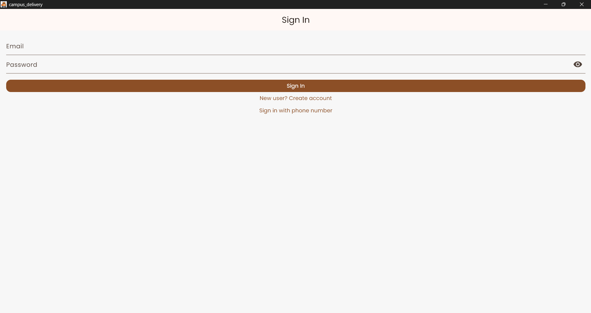

3. Create Account: Registration form for campus email, phone, and registration number.
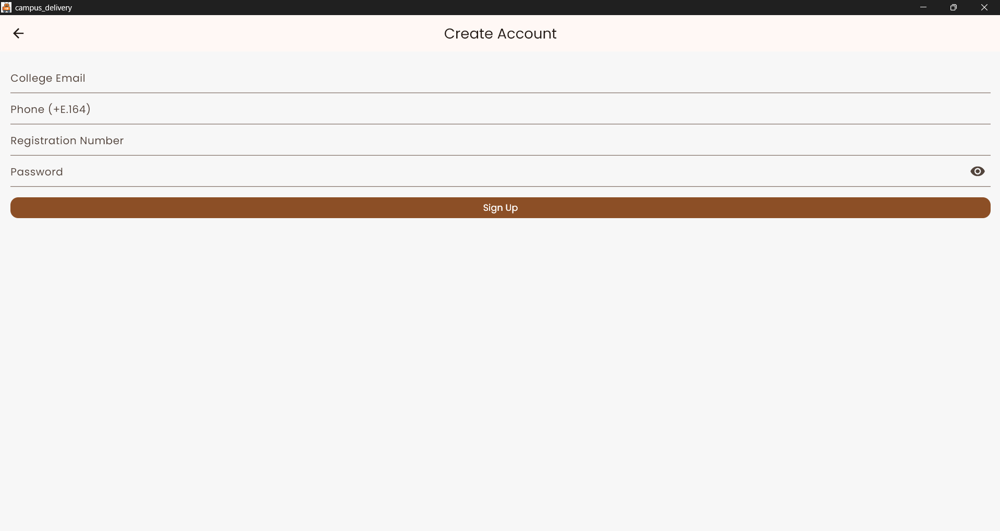

4. Phone Login: OTP-based phone sign-in flow.
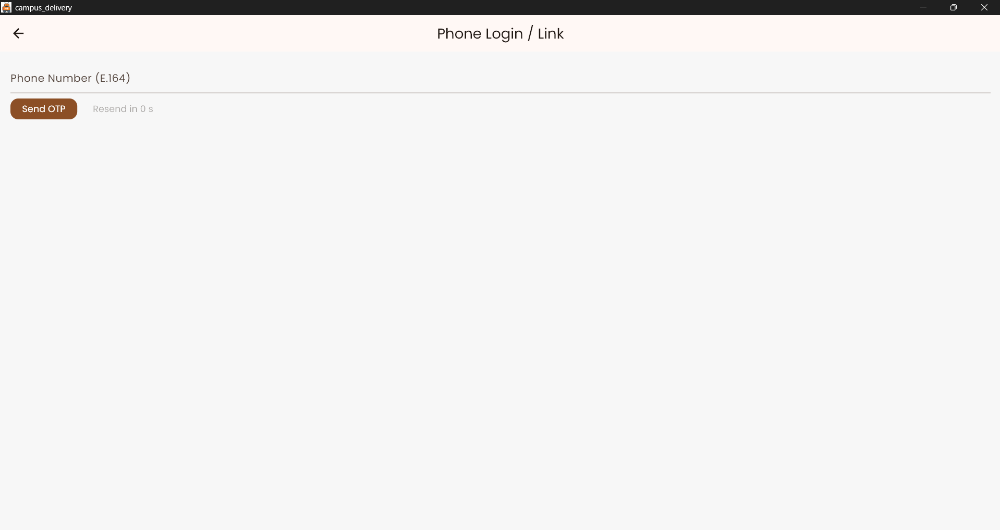

5. Home / Vendors: Vendor cards with search, ratings, and delivery times.
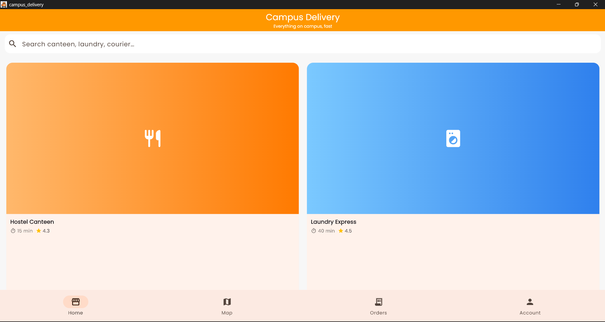

6. Live Map: Campus map view with user location and controls.
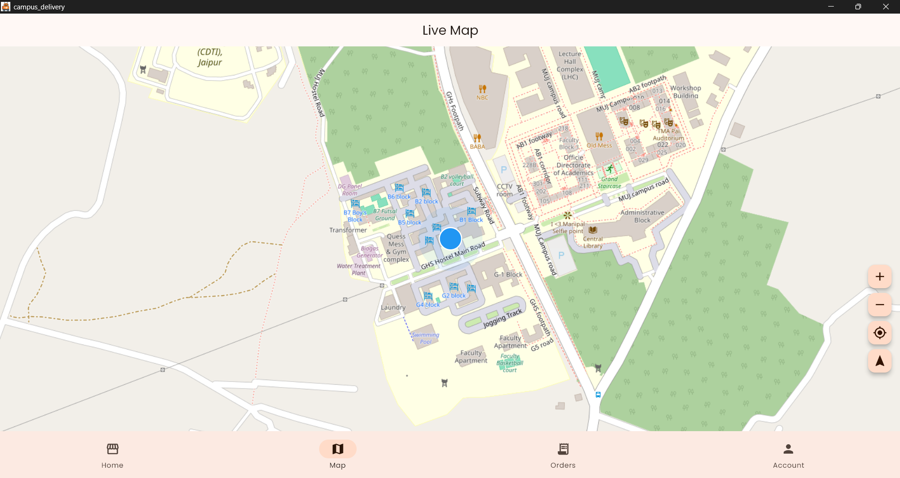

7. Orders: Order history with payment status chips.
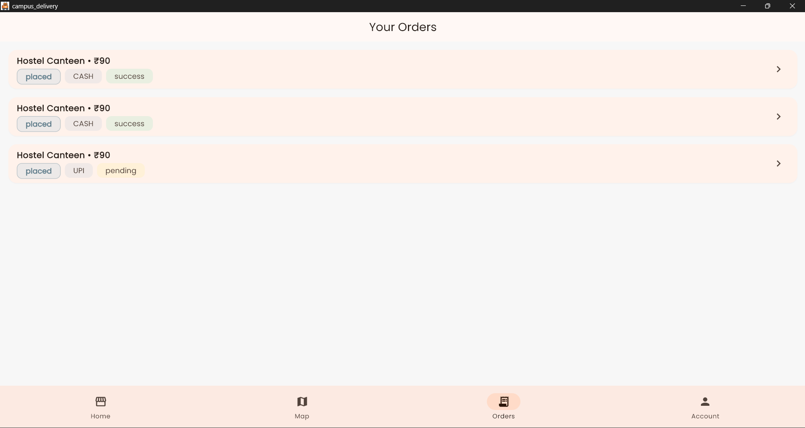

8. Account: Profile summary, settings, and logout.
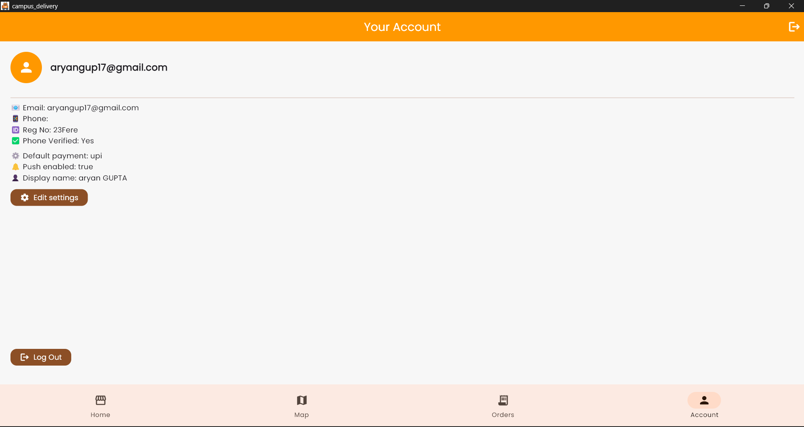

9. Settings Modal: Edit display name, default payment method, and notifications.
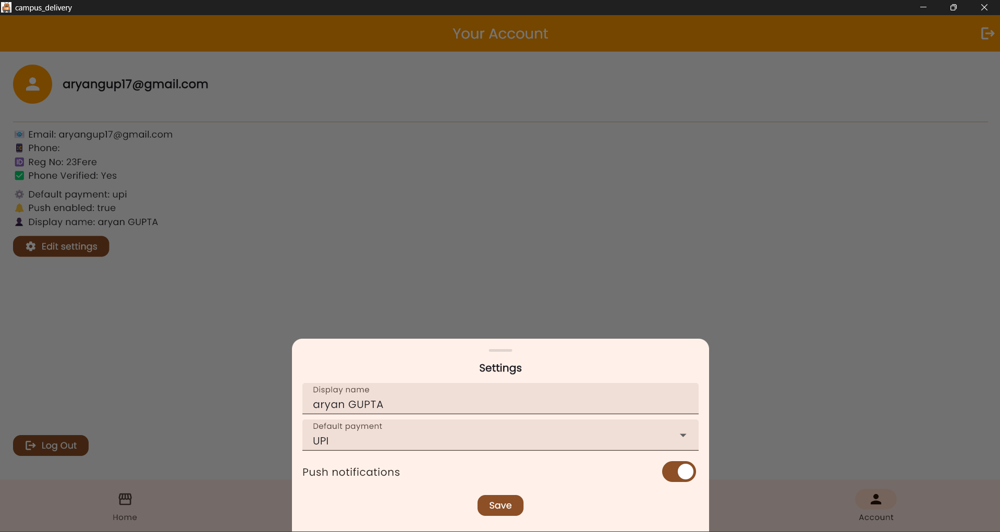

10. Cart: Cart summary.
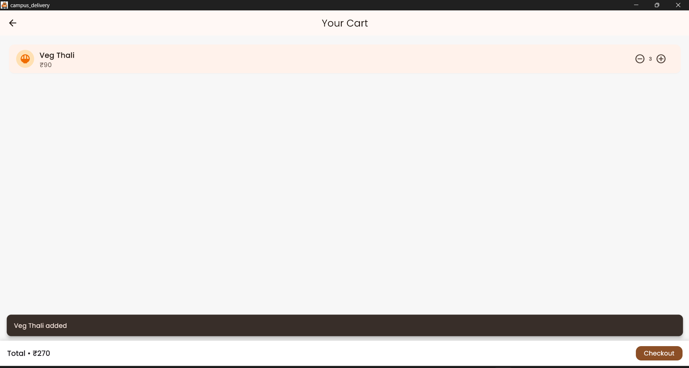

11. Cart & Checkout: Cart summary, payment method selection, and total.
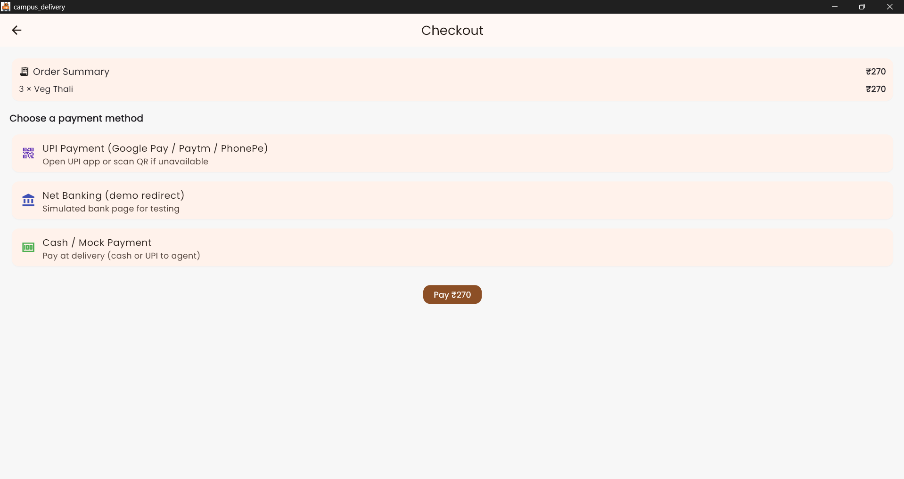

12. UPI Payment: QR-based UPI payment screen with transaction details.
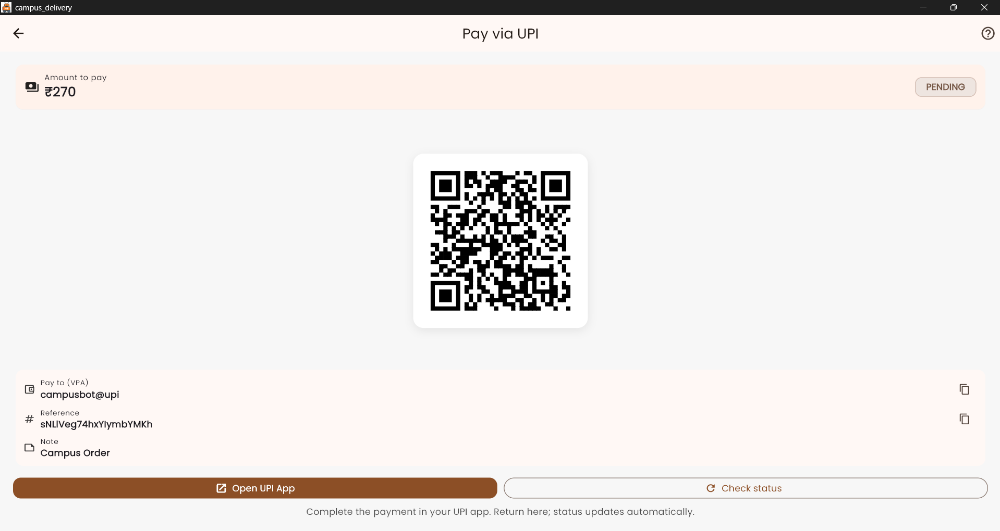

